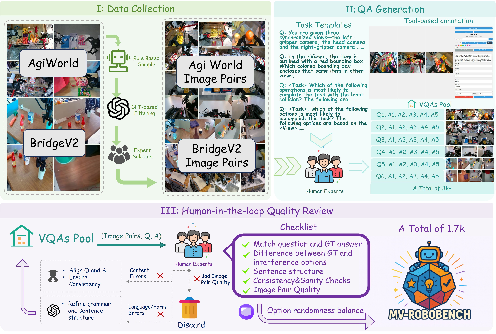
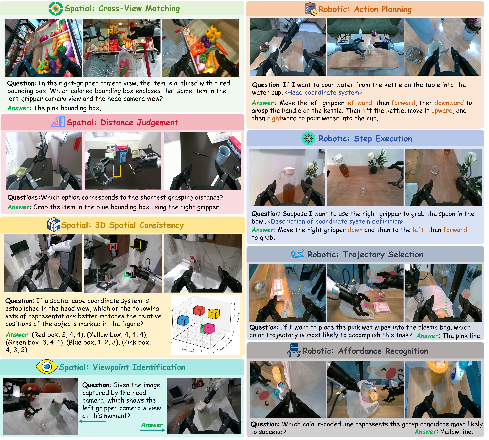

# Seeing Across Views: Benchmarking Spatial Reasoning of Vision-Language Models in Robotic Scenes

[ZhiYuan Feng](https://aaronfengzy.github.io/)¹*, Zhaolu Kang²*, Qijie Wang¹*, Zhiying Du³*, Jiongrui Yan⁴, Shi Shubin⁴, Chengbo Yuan¹, Huizhi Liang¹, Yu Deng⁵, Qixiu Li¹, Rushuai Yang⁶, Ruichuan An², Leqi Zheng¹, Weijie Wang⁷, Shawn Chen⁷, Sicheng Xu⁵, Yaobo Liang⁵, Jiaolong Yang⁵†, Baining Guo⁵

 

*¹Tsinghua University, ²Peking University, ³Fudan University, ⁴Jilin University, ⁵Microsoft Research Asia, ⁶Hong Kong University of Science and Technology, ⁷Zhejiang University*

*(\*Equal Contribution, †Corresponding Author)*

-----

    

## 🎉 News
- [x] [2025.10] 📢📢 Paper and initial project release.
- [x] [2026.01] 📦 Benchmark dataset released on [Hugging Face](https://huggingface.co/datasets/AaronFengZY24/MV_Robobench).

## 📝 To-Do List
- [ ] Release Evaluation Code
- [x] Release the benchmark dataset on [Hugging Face](https://huggingface.co/datasets/AaronFengZY24/MV_Robobench)

## MV-RoboBench

**Benchmark Overview:** We introduce *MV-RoboBench*, a benchmark designed to evaluate the multi-view spatial reasoning capabilities of VLMs in robotic scenes. It contains **[Number]** question-answer pairs across **[Number]** diverse robotic scenes. The benchmark comprises **[Number]** challenging tasks, such as **[Task 1 Name]**, **[Task 2 Name]**, and **[Task 3 Name]**. These tasks are designed to probe various aspects of 3D scene understanding, from establishing object correspondences to understanding relative spatial poses.

📌 **A Benchmark for Robotic Scenes:** We introduce *MV-RoboBench*, a comprehensive benchmark designed to evaluate the spatial reasoning of Vision-Language Models in robotic scenes.

📊 **Comprehensive Evaluation:** We evaluate [Number] state-of-the-art VLMs, including models like GPT-4o and Claude 3, revealing a significant performance gap compared to human-level reasoning.

🔍 **Revealing Core Challenges:** Our analysis pinpoints key failure modes for current models in robotic scene understanding, particularly in cross-view correspondence, relative pose estimation, and action planning.

## Contact

For any questions or suggestions, please feel free to contact [Zhiyuan Feng](mailto:t-zhifeng@microsoft.com) or another author.